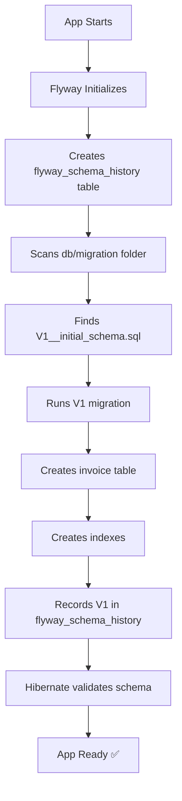

# 🦅 Flyway Implementation - Summary

## ✅ Implementation Complete!

Flyway database migration system has been successfully implemented in your invoice-service-api-v3 project.

---

## 📁 Files Changed

### 1. **Dependencies** (`pom.xml`)
- ✅ Added `flyway-core`
- ✅ Added `flyway-database-postgresql`

### 2. **Migration SQL** (NEW)
```
src/main/resources/db/migration/V1__initial_schema.sql
```
- Creates `invoice` table
- Adds 6 indexes for performance
- Includes column documentation

### 3. **Configuration Files**

#### `application.properties`
```properties
# Changed from create-drop to validate
spring.jpa.hibernate.ddl-auto=validate

# Flyway enabled
spring.flyway.enabled=true
spring.flyway.baseline-on-migrate=true
```

#### `application-prod.properties` (NEW)
- Production-optimized Flyway settings
- Fail-fast on missing migrations
- Logging configured

#### `application-local.properties`
- Local development with Flyway
- Debug logging enabled

---

## 🎯 What Problem This Solves

### Before (with `ddl-auto=create-drop`):
```
❌ App restart → All data DELETED
❌ Production database empty
❌ ERROR: relation "invoice" does not exist
❌ 500 Internal Server Error
```

### After (with Flyway):
```
✅ App restart → Data PRESERVED
✅ Production database initialized automatically
✅ invoice table created with V1 migration
✅ 200 OK - Payments work!
```

---

## 🚀 How to Deploy

### Option 1: Quick Deploy (Easiest)

Just commit and push! Flyway is configured in `application.properties`:

```bash
git add .
git commit -m "Implement Flyway database migrations"
git push origin main
```

Digital Ocean will automatically:
1. Pull latest code
2. Build with Flyway
3. Run V1 migration on startup
4. Create invoice table
5. Your API works! ✅

### Option 2: Use Production Profile (Recommended)

Add this environment variable in Digital Ocean:

```
SPRING_PROFILES_ACTIVE=prod
```

Then deploy as usual.

---

## 📊 What Happens on First Deployment



**Result:** Your production database now has the `invoice` table!

---

## 🧪 Testing (Optional but Recommended)

### Local Test:

```bash
# 1. Start local PostgreSQL (if not running)
# 2. Run the app
cd /Users/ismaelterreno/Documents/Repository/invoice-service-api-v3
./mvnw spring-boot:run -Dspring-boot.run.profiles=local

# 3. Check logs for:
# "Migrating schema public to version 1 - initial schema"
# "Successfully applied 1 migration"

# 4. Verify database:
psql -h localhost -p 5433 -U postgres -d remotejob
SELECT * FROM flyway_schema_history;
\d invoice
\q
```

---

## 📋 Quick Checklist

Before deploying to production:

- [x] ✅ Flyway dependencies added
- [x] ✅ V1 migration created
- [x] ✅ Configuration updated
- [x] ✅ Documentation created
- [ ] 🔄 Test locally (optional)
- [ ] 🚀 Deploy to production
- [ ] 🧪 Test production API

---

## 🔄 Adding Future Migrations

When you need to change the database:

```bash
# 1. Create new migration
touch src/main/resources/db/migration/V2__add_payment_method.sql

# 2. Write SQL
echo "ALTER TABLE invoice ADD COLUMN payment_method VARCHAR(255);" > V2__add_payment_method.sql

# 3. Deploy
git add .
git commit -m "Add payment_method column"
git push origin main

# Flyway automatically runs V2 on next startup!
```

---

## 📚 Documentation

Created comprehensive guides:

1. **`FLYWAY_DEPLOYMENT_GUIDE.md`** - Complete deployment instructions
2. **`DATABASE_MIGRATION_GUIDE.md`** - General database migration info
3. **`PRODUCTION_DEPLOYMENT_FIX.md`** - Quick fix for current production error
4. **`FLYWAY_IMPLEMENTATION_SUMMARY.md`** (this file) - Quick overview

---

## 🎓 Key Concepts

### What is Flyway?
Version control for your database schema (like Git for SQL).

### How does it work?
1. You write SQL files (V1, V2, V3...)
2. Flyway runs them in order
3. Tracks what's been applied
4. Never runs same migration twice

### Why is it better?
- ✅ No more `ddl-auto` surprises
- ✅ Explicit control over schema changes
- ✅ Version controlled (in Git)
- ✅ Safe for production
- ✅ Team collaboration
- ✅ Audit trail

---

## 🆘 Need Help?

### Production Database Error Still Happening?

1. Check deployment logs for Flyway messages
2. Verify `flyway_schema_history` table exists
3. See `PRODUCTION_DEPLOYMENT_FIX.md` for troubleshooting

### Want to Test Locally First?

1. See `FLYWAY_DEPLOYMENT_GUIDE.md` section "Testing Locally"
2. Follow step-by-step instructions
3. Verify database before deploying

### Migration Failed?

1. Check `flyway_schema_history` for errors:
   ```sql
   SELECT * FROM flyway_schema_history WHERE success = FALSE;
   ```
2. See troubleshooting section in `FLYWAY_DEPLOYMENT_GUIDE.md`

---

## 🎉 What You Get

### Immediate Benefits:
- ✅ Production database will be initialized automatically
- ✅ No more "relation does not exist" errors
- ✅ Data survives app restarts
- ✅ Payments will work in production

### Long-Term Benefits:
- ✅ Safe database evolution
- ✅ Rollback capability (create reverse migrations)
- ✅ Team can collaborate on schema changes
- ✅ Full audit trail of all changes
- ✅ No more database sync issues between environments

---

## 🚀 Ready to Deploy?

**Quick Deploy:**
```bash
git add .
git commit -m "Implement Flyway database migrations - fixes production database error"
git push origin main
```

**Then:**
1. Wait for Digital Ocean deployment (2-3 minutes)
2. Check deployment logs for Flyway success
3. Test payment endpoint
4. Celebrate! 🎉

---

## 📞 Support

If you encounter any issues:

1. Check **`FLYWAY_DEPLOYMENT_GUIDE.md`** - Comprehensive troubleshooting
2. Check **`DATABASE_MIGRATION_GUIDE.md`** - General database info
3. Review Flyway logs in your application output
4. Check `flyway_schema_history` table in database

---

**Summary:** Your production database issue is solved! Flyway will create the `invoice` table automatically on first deployment. 🎯

